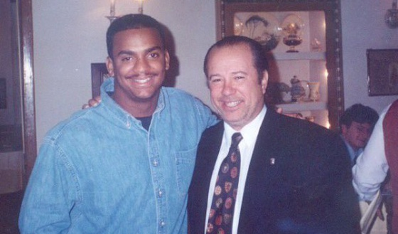

### :question: ¿Qué es CODE?

CODE significa **C**harlas **O**nline de **D**esarrollo en **E**spañol. Es una comunidad virtual de desarrolladoras y desarrolladores de software, en español y sin ánimo de lucro. La finalidad de CODE es compartir conocimiento y contar experiencias sobre desarrollo de software.

### :bulb: ¿Cómo surgió la idea?

Surgió de [una conversación en Twitter](https://masde140.com/t/meetup-virtual/279), inspirada en [VirtualJUG](https://virtualjug.com/) (una comunidad online centrada en la plataforma Java). A partir de ahí se gestó la idea de crear algo parecido pero más generalista y en español.

### :factory: ¿Cómo funciona?

Se realizan sesiones periódicas, que consisten en un hangout entre el ponente y los facilitadores. El ponente da la charla (que se emite por directo en Youtube Live) y el facilitador se encarga de presentarla y de introducir algunas de las preguntas que pueden hacer los espectadores a través del chat de Youtube. Luego, esa charla se queda almacenada en el canal de Youtube.

Utilizamos una lista de correo para gestionar los avisos de nuevas charlas, recordatorios y cambios en las mismas. Apúntate, ¡prometemos no ser nada pesados!

### :busts_in_silhouette: ¿Quién está detrás?

Dos raules: Raúl Avila y Raúl Villares. En esta sección una pequeña descripción de ambos con sendos enlaces a las webs...

### :raising_hand: Tengo que deciros algo, ¿cómo lo hago?

Lo mejor es que mandes un correo a info@comunidadcode.com :email:
